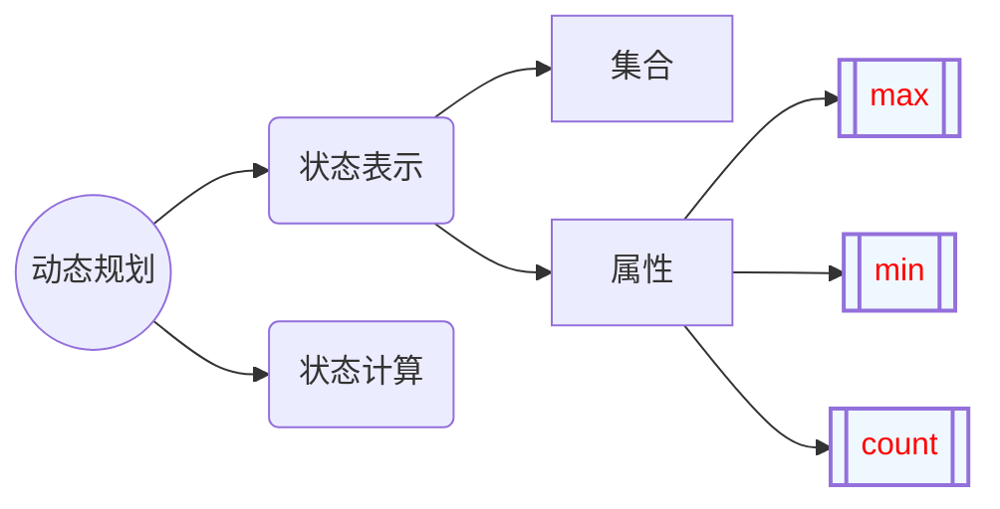
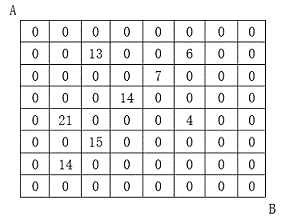
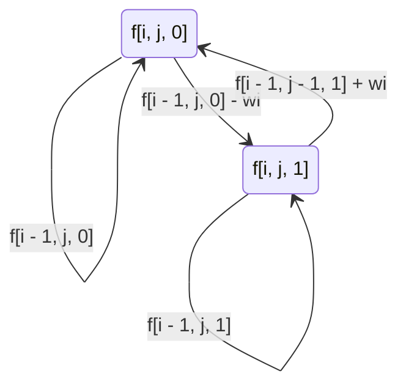
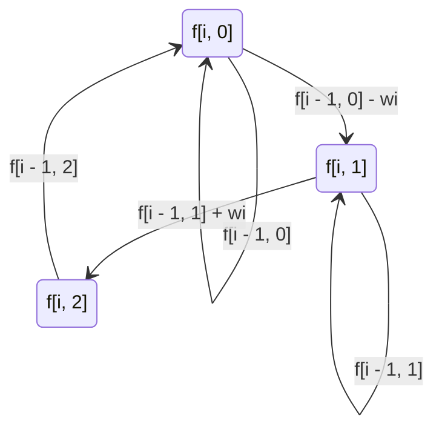

## 如何解决动态规划问题[^1]

### 核心思想

- **从集合的角度考虑问题**

### 状态表示

$$
dp[i_1, ... i_k] \triangleq s
$$

- 集合
  - 状态 $s$ 代表什么样的集合
- 属性
  - $s$ 中的数与集合的关系
  - 通常有表示极值或者数量
    - 如果表示极值，则在计算的时候可以重复，但不能遗漏
    - 如果表示数量，则必须不重不漏

### 状态计算

- 将状态 $s$ 代表的集合根据**新增的不同点**进行划分，**每个**被划分的子集为之前的某一个状态 $s'$ 所代表的集合，或者可以根据 $s'$ 计算而来
  - 例如01背包问题中即为第 $i$ 个物品选或者不选

## 常见模型

### 背包问题

#### 01背包问题

> 有 $N$ 件物品和一个容量是 $V$ 的背包。每件物品只能使用一次。第 $i$ 件物品的体积是 $v_i$，价值是 $w_i$。求在不超过背包容量的情况下能够获得的最大价值

- 闫式DP分析法
  
  $$
  \begin{cases}
状态表示: f[i, j]
\begin{cases} 集合: 只考虑前 i 个物品,且背包容量不超过 j 的方案, \\
属性: max
\end{cases} \\
状态计算:
\begin{cases}
划分: 第 i 个物品选或者不选 \\
f[i, j] = max(f[i - 1, j], f[i - 1, j - v_i] + w_i)
\end{cases}
\end{cases}
  $$

#### 完全背包问题

> 有 $N$ 件物品和一个容量是 $V$ 的背包。<mark>每件物品都有无限件可用</mark>。求在不超过背包容量的情况下能够获得的最大价值

- 闫式DP分析法
  
  $$
  \begin{cases}
状态表示: f[i, j]
\begin{cases}
集合: 只考虑前 i 个物品, 且背包容量不超过 j 的方案 \\
属性: max
\end{cases} \\
状态计算:
\begin{cases}
划分: 第 i 个物品选 0-k 次 \\
f[i, j] = max(f[i - 1, j - kv_i] + kw_i) = max(f[i - 1, j], f[i, j - v_i] + w_i)
\end{cases}
\end{cases}
  $$

#### 多重背包问题

> 有 $N$ 件物品和一个容量是 $V$ 的背包。<mark>第 $i$ 件物品最多有 $s_i$ 件</mark>。求在不超过背包容量的情况下能够获得的最大价值

- 当数据量较小时可以直接使用完全背包问题的思路
  - 第 $i$ 个物品最多可以选择的次数 $k = min(s_i, floor(j / v_i))$
- 当数据量较大时可以使用**二进制优化**[^2]将其转化为等效的01背包问题

#### 分组背包问题

> 有 $N$ 件物品和一个容量是 $V$ 的背包。<mark>每组物品有若干个，同一组内的物品最多只能选一个</mark>。每件物品的 体积是 $v_{ij}$，价值是 $w_{ij}$，其中 $i$ 是组号，$j$ 是组内编号。求在不超过背包容量的情况下能够获得的最大价值

- 闫式DP分析法
  
  $$
  \begin{cases}
状态表示: f[i, j]
\begin {cases}
集合: 只考虑前 i 组物品, 且背包容量不超过 j 的方案 \\
属性: max
\end{cases} \\
状态计算:
\begin{cases}
划分: 第 i 组物品不选或者选择第 k 个 \\
f[i, j] = max(f[i - 1, j], max(f[i - 1, j - v_{ik}] + w_{ik}))
\end{cases}
\end{cases}
  $$

- 变种
  
  - 机器分配问题
    
    > 公司有 $M$ 台相同的高效设备，准备分给下属的 $N$ 个分公司
    > 
    > 用一个 $N \times M$ 的矩阵来表示第 $i$ 个公司分配 $j$ 台机器时的盈利
    > 
    > 求最大盈利值以及对应的一种分配方案
    
    - 分析
      
      - 将机器的体积看成 1，背包总体积看成 $M$，则本题转换为简单的分组背包问题
  
  - 金明的预算方案
    
    > 金明把想买的物品分类两类：主件与附件，附件是从属于某个主件的，例如
    > 
    > 
    > 
    > **如果要买归类为附件的物品，必须先买该附件所属的主件**
    > 
    > 每个主件可以有0个、1个或者2个附件
    > 
    > 金明给每个物品规定了一个重要度，分为5等，用1-5表示，第5等最重要
    > 
    > 他希望在不超过 $N$ 元的前提下，使每件物品的价格与重要度的乘积的总和最大
    
    - 每个主件和其所属的附件可以看作是一个物品组，因此本题实际上即是分组背包问题
    
    - 提示
      
      - 可以用二进制的方式来枚举
      
      - 在枚举时必须选择主件

#### 二维01背包问题

> 背包最大体积为 $V$，最大承重为 $W$
> 
> 每个物品有一个体积 $v_i$ 一个重量 $w_i$ 和其对应的价值 $c_i$
> 
> 求背包能够容纳的最大价值

- 分析
  
  $$
  \begin{cases}
状态表示: f[k, i, j]
\begin{cases}
只考虑前 k 组物品, 且物品体积不超过 i, 物品重量不超过 j 的价值 \\
属性: max 
\end{cases} \\
状态计算: 
\begin{cases}
划分: 第 i 个物品选或者不选 \\
f[k, i, j] = \max(f[k - 1][i][j], f[k - 1][i - v_i][j - w_i] + c_i)
\end{cases}
\end{cases}
  $$

- 变种
  
  > 一个物品有两个价值 $u_i$ 和 $v_i$，物品花费 $c_i$，求达到价值 $U, V$ 所需要的最少花费
  
  - 分析
    
    $$
    \begin{cases}
状态表示: f[k, i, j]
\begin{cases}
只考虑前 k 组物品, 且价值1为 i, 价值2为 j 所需花费 \\
属性: min 
\end{cases} \\
状态计算: 
\begin{cases}
划分: 第 i 个物品选或者不选 \\
f[k, i, j] = \max(f[k - 1][i][j], f[k - 1][\max(0, i - v_i)][\max(0, j - w_i)] + c_i)
\end{cases}
\end{cases}
    $$

#### 有依赖的背包问题

> 有 $N$ 个物品和一个容量是 $V$ 的背包
> 
> 物品之间具有依赖关系，且依赖关系组成一棵树的形状，**如果选择一个物品，则必须选择其父节点**
> 
> 例如下图
> 
> 
> 
> 如果选择物品 5，则必须选择物品 1，2
> 
> 每件物品的编号是 $i$，体积是 $v_i$，价值是 $w_i$，依赖的父节点是 $p_i$，下标的范围是 $1 \dots N$，求使得物品总体积不超过背包容量的最大价值

- 分析
  
  $$
  \begin{cases}
状态表示: f[i][j]
\begin{cases}
集合: 以节点 i 为根节点, 且背包容积为 j 时的价值集合 \\
属性: \max
\end{cases}
\\
状态计算: f[i][j] = \max_{k = 0}^j f[i][j-k] + f[t][k]
\end{cases}
  $$
  
  - 在计算根节点 $i$ 在 $j$ 下的最大价值时，实际上是分组背包问题(每个子节点可选的组数即为 $0 \cdots (j - v_i)$)

#### 背包问题求方案数

> 有 $N$ 件物品和一个容量是 $V$ 的背包，每件物品只能使用一次
> 
> 第 $i$ 件物品的体积是 $v_i$，价值是 $w_i$
> 
> 求解将哪些物品装入背包，可以使得这些物品的总体积不超过背包容量，且总价值最大
> 
> 输出**最优选法的方案数量**

- 分析
  
  - 和 01 背包问题类似，需要注意的是初始化以及取等号的情况

### 线性DP

#### 方格取数

> 设有 $N \times N$ 的方格图，我们在其中的某些方格图中填入正整数，而其他的方格中则放入数字 $0$，如下图所示
> 
> 
> 
> 某人从图中的左上角 $A$ 出发，可以向下行走，也可以向右行走，直到到达右下角 $B$ 点，在走过的路上，他可以取走方格中的数（取走后将方格中的数字变为 $0$），此人从 $A$ 到 $B$ 共走了两次，试找出这样的两条路径，使得取得的数字和最大

- DP 分析
  
  $$
  \begin{cases}
状态表示: f[r_1][c_1][r_2][c_2]
\begin{cases}
集合: 同时从 (1, 1)(1, 1) 走到 (r_1, c_1)(r_2, c_2) 的路径的集合 \\
属性: max
\end{cases}
\\
状态计算: f[r_1][c_1][r_2][c_2] = 
\begin{cases}
x + w[r_1, c_1]  \quad if \;r_1 = r_2 \;\; and \;\; c_1 = c_2 \\ 
x + w[r_1, c_1] + w[r_2, c_2] \quad if \; r_1 \ne r_2 \;\; or \;\; c_1 \ne c_2 \\
x = 转移来四个方向上的最大路径集合
\end{cases}
\end{cases}
  $$
  
  - $r_1 + c_1$ 必须等于 $r_2 + c_2$
    
    - 两个点必须同时出发，而不能分开两次走
    
    - 原因？
      
      > 因为第一次走的时候有可能有好几条路径都是第一次的解，而你分开走只能选择其中的一条。很不幸的是，第一次走过的地方会被重置成0，而你不确定的是第一次同样是最优解而未被你选择的情况下第二次的值会不会比你已经得出的答案要大。
  
  - 只有当两条路径走的步长相同时，才有可能出现重复点

#### 传纸条

> 设有 $M \times N$ 的矩阵，$A$ 和 $B$ 分别坐在矩阵的左上角$(1, 1)$和右下角$(m, n)$，矩阵的每一格中有一个数，求 $A \rightarrow B$ 和 $B \rightarrow A$ 的过程中，<mark>不重复经过格子</mark> 的最大路径和

- 显然题目可以看作是 $A \rightarrow B$ 两次，但要注意，与方格取数的区别在于
  
  - 方格取数：可以经过相同的点，但第二次走相同的点时取值为 $0$
  
  - 传纸条：不可以经过相同的点
  
  > 显然方格取数中，一定可以找到两条路，使得可以不走重复的点取得最大值(因为取值为 0，因此不会有比该点更差的点)，因此实际上两道题是等价的

#### 最长上升子序列

> 给定一个长度为 $N$ 的数列，求数值严格单调递增的子序列的长度最长是多少

- 朴素版本闫式DP分析法
  
  $$
  \begin{cases}
状态表示: f[i]
\begin{cases}
集合: 数组中前 i 个数并且以第 i 个数结尾的子序列 \\
属性: max
\end{cases} \\
状态计算:
\begin{cases}
划分: 子序列的倒数第二个数是数组中的第 j 个数(j \in [0, i - 1] 且 arr[i] > arr[j]) \\
f[i] = \max(f[j]) + 1
\end{cases}
\end{cases}
  $$

- 优化版本本质上更像贪心[^3]
  
  - $dp[i]$：所有长度为 $i$ 的上升子序列中**末尾**元素的**最小值**
  - 显然 $dp []$ 满足如下性质
    - 数组元素单调递增
    - 数组长度即为最长上升子序列的长度

#### 非上升子序列的最小覆盖

> 给定一个长度为 $N$ 的数列，求最少使用多少个非上升子序列能覆盖数列中的所有元素

- **等价于求解数列的最长上升子序列**

- 分析
  
  - 对于数列中的每个元素，存在以下两种操作
    
    1. 作为一个新的非上升子序列的开头
    
    2. 添加到已经存在的某个非上升子序列的结尾
  
  - 用贪心的思想来分析操作 2，可以猜测应该把该元素添加到最小的比它大的序列的末尾(容易证明)
  
  - 若我们用一个数组来存储每个非上升子序列的末尾元素，则添加规则为
    
    1. 若该元素比所有已存在的末尾元素都要大，则必须创建新的非上升子序列，并且该元素作为末尾元素
    
    2. 否则，将该元素放到比该元素大的(所有末尾元素中)最小的非上升子序列中，并作为新的末尾元素
    
    **以上两条和最长上升子序列中贪心的添加规则完全一致**

#### 上升/下降子序列的最小覆盖

> 给定一个长度为 $N$ 的数列，求最小使用多少个满足条件的序列能够覆盖数列中的所有元素。一个数列 $A$ 称为满足条件的序列，若其满足以下任意一条
> 
> - A 是严格单调递增的序列
> 
> - $A$ 是严格单调递减的序列

- 在上一题的基础上加入 dfs 搜索(每个点可以属于最长上升子序列，也可以属于最长下降子序列)

#### 最长公共上升子序列

> 给定长度为 $N$ 的数列 $A$ 和 $B$，求其最长公共上升子序列。
> 
> 对于两个数列 $A$ 和 $B$，最长公共上升子序列 $C$ 满足如下条件
> 
> - $C$ 是 $A$ 的子序列
> 
> - $C$ 是 $B$ 的子序列
> 
> - $C$ 是上升子序列

- 分析
  
  - 本题实际上相当于**最长公共子序列**和**最长上升子序列**的合并

- 集合分析
  
  $$
  \begin{cases}
状态表示: f[i, j]
\begin{cases}
集合: 字符串 A 的前 i 个字符和字符串 B 的前 j 个字符构成的， \\
且以 B[j] 结尾的公共子序列的长度 \\
属性: max
\end{cases} \\
状态计算:
\begin{cases}
划分: A[i] 和 B[j] 是否相等(A[i] 是否在最长公共子序列中) \\
\begin{cases}
f[i, j] = \max (1, f[i - 1][j], \smash{\displaystyle\max_{k = 1}^{j - 1}} (f[i - 1][k] + 1)), & if (A[i] = B[j] \; and \; A[i] > B[k]) \\
f[i, j] = f[i - 1][j] & if(A[i] \ne B[j])
\end{cases}
\end{cases}
\end{cases}
  $$

#### 不同的子序列 II

> 给定一个只包含 26 个英文小写字母的字符串 `s`，计算 `s` 的 **不同非空子序列** 的个数。

- 解题要点
  
  - 对于 $i, j, \; i < j$ 且 $s[i] == s[j]$，则 $s$ 的以第 $i$ 个数为结尾的非空子序列同样包含于 $s$ 的以第 $j$ 个数为结尾的非空子序列
    
    - 只需要在以 $j$ 为结尾的子序列中，$i, i + 1 \cdots j - 1$ 全都不选即可
  
  - 对于 $i, j, \; i < j$ 且 $s[i] \ne s[j]$，则 $s$ 的以第 $i$ 个数为结尾的非空子序列与 $s$ 的以第 $j$ 个数为结尾的非空子序列必然互不相同
  
  - 由上述两点可以进一步推断出，$s$ 的以第 $i$ 个数为结尾的非空子序列可以由 26 个倒数第二个不同的数转移过来

- 集合分析
  
  $$
  \begin{cases}
状态表示: f[i] 
\begin{cases}
集合: 以字符串 s 的第 i 个字符结尾的非空子序列的个数 \\
属性: max
\end{cases} \\
状态计算
\begin{cases}
划分: 子序列的倒数第 2 个数是什么 \\
f[i] = \smash{\displaystyle\sum_{ 0 \le k < 26, lask[k] \ne -1}} f[last[k]] + 1
\end{cases}
\end{cases}
  $$
  
  > - $+ 1$ 表示没有倒数第 2 个数
  > 
  > - $last[k]$ 表示 $s[1 \cdots i - 1]$ 中以 $'a' + k$ 为结尾的最大的下表

#### 登山

> 某队伍组织去登山观光，山上一共有 $N$ 个景点，并且队伍决定按照顺序来浏览这些景点，即 <mark>每次浏览的景点编号都要大于前一个浏览景点的编号</mark>
> 
> 队伍还有另一个登山习惯，即不连续浏览海拔相同的两个景点，并且一旦开始下山就不再往上走了
> 
> 求队伍在满足上述两个条件时，所能浏览的最多景点数量

- 实际上相当于求每一个景点的最长上升子序列和最长下降子序列

- 题目变种(合唱队形)
  
  > $N$ 位同学站成一排，音乐老师要请其中的 $N - K$ 位同学出列，使得剩下的 $K$ 位同学排成合唱队形
  > 
  > 合唱队形是指这样的一种队形，设 $K$ 位同学从左至右依次编号为 $1, 2, \cdots, K$，他们的身高分别为 $T_1, T_2, \cdots, T_K$，则他们的身高满足
  > 
  > $$
  > T_1 < \cdots < T_i > T_{i + 1} > \cdots > T_K (1 \le i \le K)
  > $$
  > 
  > 已知所有 $N$ 位同学的身高，计算最少需要几位同学出列，可以使得剩下的同学排成合唱队形

#### 友好城市

> 河的南北两岸有位置各不相同的 $N$ 个城市
> 
> 北岸的每个城市**有且仅有一个友好城市在南岸**，且**不同城市的友好城市不相同**
> 
> 每个友好城市都向政府申请在河上开辟一条直线航道连接两个城市，但是由于河上雾太大，政府决定避免任意两条航道交叉，以避免事故
> 
> 编程帮助政府做出一些批准和拒绝申请的决定，使得在保证任意两条航线不相交的情况下，被批准的申请尽量多

- 本题的关键点在于：**若将某一岸城市的坐标按照从小到大排序，则对岸友好城市也必然从小到大排序**，否则必然会存在相交的情况

- 因此本题实际上即是最长上升子序列问题

#### 最长公共子序列

> 给定两个长度分别为 $N$ 和 $M$ 的字符串 $A$ 和 $B$，求既是 $A$ 的子序列又是 $B$ 的子序列的字符串长度最长是多少

- 闫式DP分析法
  
  $$
  \begin{cases}
状态表示: f[i, j]
\begin{cases}
集合: 字符串 A 的前 i 个字符和字符串 B 的前 j 个字符所有公共子序列的长度 \\
属性: max
\end{cases} \\
状态计算:
\begin{cases}
划分: A[i] 和 B[j] 是否相等 \\
\begin{cases}
f[i, j] = f[i - 1][j - 1] + 1, & if (A[i] = B[j]) \\
f[i, j] = max(f[i - 1][j], f[i][j - 1]) & if(A[i] \ne B[j])
\end{cases}
\end{cases}
\end{cases}
  $$

#### 最短编辑距离

> 给定两个字符串 $A$ 和 $B$，现在要将 $A$ 经过若干操作变为 $B$，可进行的操作有
> 
> 1. 删除：将字符串 $A$ 中的某个字符删除
> 2. 插入：在字符串 $A$ 的某个位置插入某个字符
> 3. 替换：将字符串 $A$ 中的某个字符替换为另一个字符
> 
> 求将 $A$ 变为 $B$ 至少需要进行多少次操作

- 闫式DP分析法
  
  $$
  \begin{cases}
状态表示: f[i, j]
\begin{cases}
集合: 将 A 的前 i 个字符变为 B 的前 j 个字符需要操作的次数 \\
属性: min
\end{cases} \\
状态计算:
\begin{cases}
划分: A[i] 和 B[j] 是否相等, 如果不相等，则执行三种操作 \\
\begin{cases}
f[i, j] = f[i - 1, j - 1] & if (A[i] = B[j]) \\
f[i, j] = min(f[i - 1, j - 1], f[i - 1, j], f[i, j - 1]) + 1 & if (A[i] != B[j])
\end{cases}
\end{cases}
\end{cases}
  $$

### 区间DP

- 区间合并问题循环中通常先**枚举区间长度**，再**枚举左端点起始位置**

#### 石子合并

> 设有 $N$ 堆石子拍成一排，其编号为 $1, 2, \dots, N$。每堆石子有一定的质量，可以用一个整数来描述，现在要将这 $N$ 堆石子合并成为一堆。
> 
> 每次只能合并相邻的两堆，合并的代价为这两堆石子的质量之和，合并后与这两堆石子相邻的石子将和新堆相邻，合并时由于选择的顺序不同，合并的总代价也不相同。
> 
> 找出一种合理的方法，使总代价最小，输出最小代价

- 闫式DP分析法
  
  $$
  \begin{cases}
状态表示: f[i, j]
\begin{cases}
集合: 长度为 i 且左端点 j 的所有合并方法的代价 \\
属性: min
\end{cases} \\
状态计算:
\begin{cases}
划分: 由 [l, k] 和 (k, r] 两堆石子合并而来(r = l + i - 1) \\
f[i, j] = min(f[l][k] + f[k + 1][r]) + \sum_{t = l}^r w_t & (k \in [l, r), w_t 为第 t 堆石子的重量)
\end{cases}
\end{cases}
  $$

#### 环形石子合并

> 石子排列的方式不是一排而是环绕摆放

- 将环形展平成一排即可
  
  > 例如原来一堆石子的质量为 $weights[1 : n + 1]$，则新的石子用 $weights[1 : 2 \times n + 1]$ 来表示，且 $weights[n + 1 : 2 \times n + 1] = weights[1 : n + 1]$

#### 加分二叉树

> 设一个 $n$ 个节点的二叉树 tree 的中序遍历为 $(1, 2, 3, \cdots, n)$，其中数字 $(1, 2, \cdots, n)$ 为节点编号
> 
> 每个节点都有一个分数，记第 $i$ 个节点的分数为 $d_i$，tree 及他的每个子树都有一个加分，任一颗子树 subtree 的加分计算方法如下：
> 
> subtree 的左子树的加分 $\times$ subtree 的右子树的加分 $+$ subtree 的根的分数  
> 
> 求 tree 的最高加分

- 分析
  
  $$
  \begin{cases}
状态表示: f[i, j] 
\begin{cases}
集合: 中序遍历为  i - j 的子树的加分
\\
属性: 最高加分
\end{cases}
\\
状态计算:
\begin{cases}
划分: 根节点的位置 \\
f[i, j] = \min_{k = i}^j f[i][k - 1] \times f[k + 1][j] + score[k]
\end{cases}
\end{cases}
  $$

#### 凸多边形的划分

> 给定一个具有 $N$ 个顶点的凸多边形，将定点从 $1$ 至 $N$ 标号，每个顶点的权值都是一个正整数
> 
> 将这个凸多边形分成 $N - 2$ 个互不相交的三角形，对于每个三角形，其三个顶点的权值相乘都可得到一个权值乘积，试求三角形的顶点权值乘积之和至少为多少

- 分析
  
  $$
  \begin{cases}
状态表示: f[i, j]
\begin{cases}
集合: 以 (i, i + 1), (i + 1, i + 2), \cdots , (j, i) 为边构成的凸多边形乘积之和的集合
\\
属性: 最小值
\end{cases}
\\
状态计算:
\begin{cases}
划分: 以 (i, j) 为三角形的一边, 另一个顶点的位置
\\
f[i, j] = \min_{k = i + 1}^{j - 1} f[i][k] + f[k][j] + weight[l] \times weight[k] \times weight[r]
\end{cases}
\end{cases}
  $$
  
  - 划分实际上不一定要以 $(i, j)$ 为边，实际上任意一条边为边都可以

### 计数类DP

#### 整数划分

> 一个正整数可以表示成若干个正整数之和，形如 $n = \sum_{i = 1}^k n_i$，其中$n_1 \ge n_2 \ge \cdots \ge n_k, k \ge 1$。
> 
> 我们将这样的一种表示称为正整数 $n$ 的一种划分
> 
> 给定一个正整数 $n$，求 $n$ 共有多少种不同的划分方法

- 本题可看作**==完全背包问题==**的变形
  
  > 将 $1, 2, \cdots, n$ 看作 $n$ 个物品的体积

- 闫式DP分析法
  
  $$
  \begin{cases}
状态表示: f[i, j]
\begin{cases}
集合: 只考虑 1-i, 且总和不超过 j 的方案树 \\
属性: count
\end{cases} \\
状态计算:
\begin{cases}
划分: 第 i 个数选 0 - k 次 \\
f[i, j] = \sum_{t = 0}^k f[i - 1, j - ti] = f[i - 1, j] + f[i, j - i]
\end{cases}
\end{cases}
  $$

### 数位统计DP

- ``**暂略，有点难** ``

### 状态压缩DP

- 解决状态压缩DP问题的基本思路
  - 预处理合法的状态
  - 状态转移

#### 蒙德里安的梦想

> 求把 $N \times M$ 的棋盘分割成若干个 $1 \times 2$ 的长方形，有多少种方案

- 只需要考虑所有竖着的 $1 \times 2$ 长方形的摆放方法数

- 闫式DP分析法
  
  $$
  \begin{cases}
状态表示: f[i, j]
\begin{cases}
集合: 前 i - 1 行已经摆好, 且伸出到第 i 行状态为 j 的方案 \\
属性: count
\end{cases} \\
状态计算:
\begin{cases}
划分: 所有能从 f[i - 1, k] 合法转移到 f[i, j] 的状态 \\
f[i, j] = \sum\limits_{k} f[i - 1, k], \quad s.t. \; (j \& k = 0 \; and \; is\_valid(j | k)
\end{cases}
\end{cases}
  $$

#### 最短 Hamilton 路径

> 给定一张 $n$ 个点的带权无向图，点从 $0 \backsim n - 1$ 标号，求起点 $0$ 到终点 $n - 1$ 的最短 Hamilton 路径。
> 
> Hamilton 路径的定义是从 $0 \backsim n - 1$ 不重不漏的经过每个点恰好一次

- 用二进制数 $i$ 表示已经走过的路径(某个点走过其对应的二进制为 $1$)

- 闫式DP分析法
  
  $$
  \begin{cases}
状态表示: f[i, j]
\begin{cases}
集合: 从 0 走到 j 且路径为 i 的所有距离 \\
属性: min
\end{cases} \\
状态计算:
\begin{cases}
划分: 所有能从 f[i ^\wedge (1 << j), k] 转移到 f[i, j] 的状态 \\
f[i, j] = \min(f[i ^\wedge (1 << j), k] + w[k, j]), \quad s.t. \;(i >> j \& 1 \; and \; i ^\wedge (1 << j) >> k \& 1)
\end{cases}
\end{cases}
  $$

#### 小国王

> 在 $n \times n$ 的棋盘上放 $k$ 个国王，国王可攻击相邻的 $8$ 个格子，求使它们无法互相攻击的方案总数

- 闫式DP分析法
  
  $$
  \begin{cases}
状态表示: f[i, j, s]
\begin{cases}
集合: 前 i 行已经放置 j 个国王, 且第 i 行的状态为 s 的方案 \\
属性: count
\end{cases} \\
状态计算:
\begin{cases}
划分: 所有能从 f[i - 1, j - cnt[s], s'] 转移到 f[i, j, s] 的方案 \\
f[i, j, s] = \sum\ f[i - 1, j - cnt[s], s'], \; 其中 cnt[s] 表示状态 s 二进制表示中 1 的个数, s' 能合法转移到 s
\end{cases}
\end{cases}
  $$

### 树形DP

#### 没有上司的舞会

> Ural 大学有 $N$ 名职员，编号为 $1 \backsim N$。
> 
> 他们的关系就像一棵以校长为根的树，父节点就是子节点的直接上司。
> 
> 每个职员有一个快乐指数，用整数 $H_i$ 给出，其中 $1 \le i \le N$。
> 
> 现在要召开一场周年庆宴会，不过，没有职员愿意和直接上司一起参会。
> 
> 在满足这个条件的前提下，主办方希望邀请一部分职员参会，使得所有参会职员的快乐指数总和最大，求这个最大值

- 闫式DP分析法
  
  $$
  \begin{cases}
状态表示: f[i, j]
\begin{cases}
集合: 以节点 i 为根节点的子树在状态 j(0 代表不选 i, 1 代表选 i)下的所有快乐指数 \\
属性: \max
\end{cases} \\
状态计算:
\begin{cases}
划分: j = 0 \; or \; 1 \\
\begin{cases}
f[i, 0] = \sum\limits_{c \in i.children} \max(f[c, 0], f[c, 1]) \\
f[i, 1] = \sum\limits_{c \in i.children} f[c, 0]
\end{cases}
\end{cases}
\end{cases}
  $$

#### 树的最长路径(直径)

> 给定一棵树，树中包含 $n$ 个节点，编号 $1 \backsim n$ 和 $n - 1$ 条无向边，每条边都有一个权值。
> 
> 请找到一条路径，使得路径两端点的距离最短

- 本题的关键在于
  - **经过某一个点且不经过其父节点的最长距离为以其为根节点的树的最长深度和第二长深度之和**
  - **树的直径即以任一个点为根节点的树最长深度和次长深度之和的最大值**
- 在 `dfs(u, fa)` 中用父节点 `fa` 来控制不走回头路
- **如果树的边权都是正整数**，则可以有另一种解法
  - 以任意一点 $u$ 为根节点，通过 DFS 找出距离 $u$ 最远的点 $v$
  - 则 $v$ 必然是一条直径的端点
  - $v$ 与距离 $v$ 最远的点 $v'$ 构成的路径即为树的直径

#### 树的中心

> 给定一棵树，树中包含 $n$ 个节点(编号 $1 \sim n$) 和 $n - 1$ 条无向边，每条边都有一个权值
> 
> 请在树中找到一个点，使得该点到树中其他节点的最远距离最近

- 一个直觉的想法是，利用 dfs 求出每个点到树中其他节点的最远距离
  
  - 显然会超时 $O(n^2)$

- 在求树的直径时，我们只算了每个点可以向下走的最长距离，但是在本题中，我们还需要算每个点向上走的最长距离，于是在已经求出每个点向下走的最长距离的基础上，我们还需要分以下两种情况求点 $u$ 的父节点 $v$ 向上走的最长距离
  
  1. $v$ 仍往上走
  
  2. 向下走
     
     - $u$ 向下走的最长距离经过子节点 $u$，此时最长距离为 $u \rightarrow v \rightarrow v 向下走的次长距离$
     
     - $u$ 向下走的最长距离不经过子节点 $u$，此时最长距离为 $u \rightarrow v \rightarrow v 向下走的最长距离$

#### 数字转换

> 如果一个数 $x$ 的约数(不包括其本身)之和为 $y$ 比他小，那么 $x$ 可以变成 $y$，$y$ 也可以变成 $x$
> 
> 例如 $4$ 可以变成 $3$，$1$ 可以变成 $7$
> 
> 限定所有数字变换在不超过 $n$ 的正整数范围内进行，求不断进行数字变换且不出现重复数字的最多变换步数

- 若将变换看成一条无向边，此题即变成求树的直径

### 状态机DP

#### 使序列递增的最小交换次数

> 给定两个长度相当且不为空的整型数组 `A` 和 `B`，在一次操作中，可以交换 `A[i]` 和 `B[i]` 的元素，求使得 `A` 和 `B` 严格递增所需操作的最小次数(假定这样的操作必定存在)

- 本题的关键在于分析出若数组 `A`，`B` 符合条件，则对于任意 `i`，毕竟满足以下两个条件(状态)之一
  
  1. $A[i] > A[i - 1]  \quad and \quad B[i] > B[i - 1]$
  
  2. $A[i] > B[i - 1] \quad and \quad B[i] > A[i - 1]$

- 因此我们可以得出
  
  $$
  \begin{cases}
状态表示: f[i][0...1]
\begin{cases}
集合: 前 i 个数满中足序列递增的交换次数 \\
属性: \min
\end{cases} \\
状态计算:
\begin{cases}
f[i][0] = f[i - 1][0], \; f[i][1] = f[i - 1][1] + 1 \quad 如果只满足条件 1 \\
f[i][0] = f[i - 1][1], \; f[i][1] = f[i - 1][0] + 1 \quad 如果只满足条件 2 \\
如果同时满足条件 1, 2
\begin{cases}
f[i][0] = \min(f[i - 1][0], f[i - 1][1]) \\
f[i][1] = \min(f[i - 1][1] + 1, f[i - 1][0] + 1) \\
\end{cases}
\end{cases}
\end{cases}
  $$

#### 股票买卖 IV

> 给定一个长度为 $N$ 的数组，数组中的第 $i$ 数字表示一个给定股票在第 $i$  天的价格
> 
> 不能同时参与多笔交易(必须在购买前出售掉之前的股票)，一次买入卖出合为一笔交易
> 
> 在最多可以完成 $k$ 笔交易的前提下，求能够获取的最大利润

- 状态图如下所示，其中 $f[i, j, 0/1]$ 表示前 $i$ 天一共交易 $j$ 次，且不持有/持有股票的最大利润

#### 股票买卖 V

> 给定一个长度为 $N$ 的数组，数组中的第 $i$ 个数字表示一个给定股票在第 $i$ 天的价格
> 
> 设计一个算法算出最大利润，在满足以下约束条件下，你可以尽可能的完成更多的交易
> 
> - 不能同时参与多笔交易(必须在再次购买前出售掉之前的股票)
> 
> - 卖出股票后，无法在第二天买入股票(冷冻期为一天)

- 状态图如下所示，其中 $f[i, 0/1/2]$ 表示前 $i$ 天不持有/冷冻期/卖出股票的最大利润

## refs

[^1]: [闫式DP分析法](https://www.cnblogs.com/IzayoiMiku/p/13635809.html)

[^2]: [多重背包问题$\rm{II}$](https://www.acwing.com/solution/content/5527/)

[^3]: [最长上升子序列$\rm{II}$](https://www.acwing.com/solution/content/3783/)
