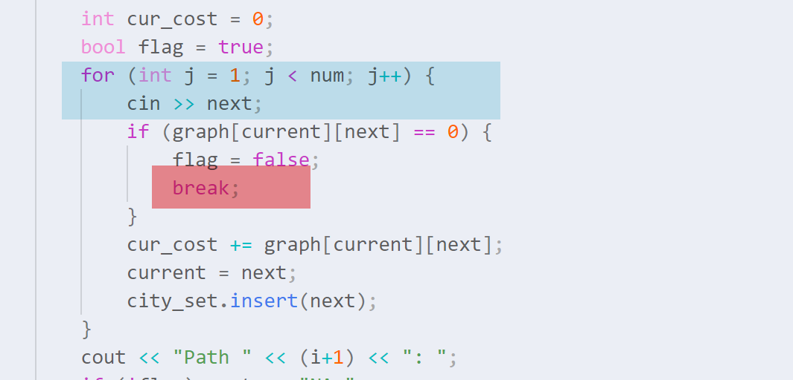

## 过早break

看到 [PAT 1150](https://pintia.cn/problem-sets/994805342720868352/problems/1038430013544464384) 的时候第一反应是非常简单，但跑完测试代码之后前两个测试点却一直过不了，仔细看看代码逻辑似乎没有问题，最后从[这篇文章](https://www.codeleading.com/article/8158359241/)中发现了问题的所在——==在输入的时候break了==

### 例子

可以发现这里的break影响了 `cin >> next`，导致之后的输入全部错误