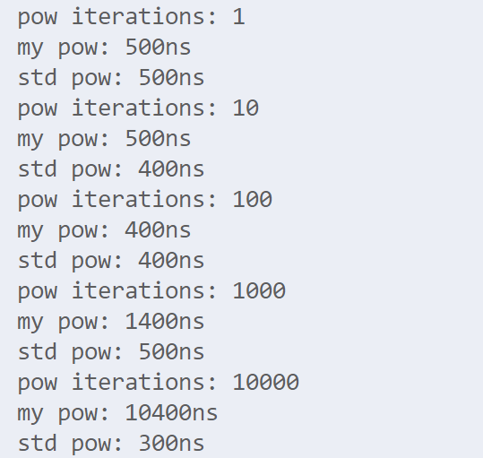

- [过早break](early-break.md)
  
- [PAT 1150](https://pintia.cn/problem-sets/994805342720868352/problems/1038430013544464384)
  
- [字符串前导0](forward-zero.md)
  
- [PAT 1139](https://pintia.cn/problem-sets/994805342720868352/problems/994805344776077312)
  
- [浮点数精度问题](decimal.md)
  
- [PAT 1104](https://pintia.cn/problem-sets/994805342720868352/problems/994805363914686464)
  
- [I/O](input-output.md)
  - 一次读取一行
    - [PAT 1100](https://pintia.cn/problem-sets/994805342720868352/problems/994805367156883456)

- 字符串末尾多输出空格
  - 有些题目会限制末尾不能多输出空格
  - [PAT 1081](https://pintia.cn/problem-sets/994805342720868352/problems/994805386161274880)

- 在遇到 `pow` 运算时，当乘方次数较小(100次以内)可以使用 `for` 循环，否则尽量使用标准库函数

  - [PAT 1079](https://pintia.cn/problem-sets/994805342720868352/problems/994805388447170560)

  - 下图是 $1.8 * (1 + 0.01)^{\text{iterations}}$ 的测试结果

    

- ==重载运算符造成段错误？？==
  - [PAT 1080](https://pintia.cn/problem-sets/994805342720868352/problems/994805387268571136)
    - 该题如果重载运算符 `<` 会有一个测试样例段错误(测试应该是输入的时候？)，太奇怪了……

- 链表中不一定所有的节点都是有用的，可能存在无用的节点
  
  - [PAT 1074](https://pintia.cn/problem-sets/994805342720868352/problems/994805394512134144)

- I/O精度

  - 在 `c++` 中下面代码的输出结果为 `0.1` 、`0.2`、`0.2`

    ```c++
    #include <iostream>
    #include <iomanip>
    #include <cmath>
    
    using namespace std;
    
    int main() {
        cout << setprecision(1) << setiosflags(ios::fixed);
        cout << 0.15 << "\n";
        cout << 0.15001 << "\n";
        cout << round(0.15 * 10) / 10.0 << "\n";
    
        return 0;
    }
    ```

- 字符串前导零

  - [PAT 1060](https://pintia.cn/problem-sets/994805342720868352/problems/994805413520719872)

    - 这道题出的非常坑，题目描述不太清楚，需要注意以下几点

      - 去掉字符串无用的前导0

      - 考虑指数为负数

      - 指数为0、1都要写

      - `0` 应该表示为 `0.00...0*10^0` 

        > 小数点后零的个数为精度