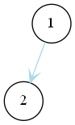
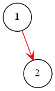
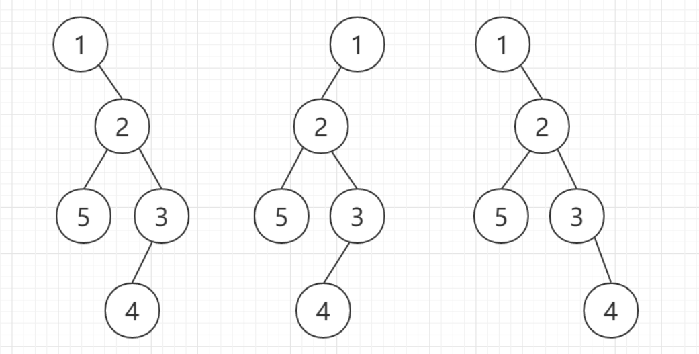

## 总结

- 根据给定序列构建二叉树的关键步骤如下
  1. **找出当前根节点**
  2. **找出左、右子树根节点**
  3. **递归构造左右子树**

## 中序 + 前序构建二叉树

- 符号约定
  
  - 前序序列($pre\_order$) $ := \lbrace a_1, \cdots , a_n \rbrace $
  - 中序序列($in\_order$) $ := \lbrace b_1, \cdots, b_n \rbrace $

- 步骤
  
  1. 确定根节点($a_1$)在 $in\_order$ 中的位置 $root\_pos$
  
  2. 根据中序的性质可以知道 $in\_order$ 左边的节点构成左子树，右边的节点构成右子树。据此我们可以得左子树的节点个数 $left\_num$ 和右子树的节点个数 $right\_num$
  
  3. 根据前序的性质可以知道左子树的根节点为 $a_2$，右子树的根节点为 $a_{2+left\_num}$
  
  4. 重复2-3

- 如何构建
  
  - [liuchuo](https://www.liuchuo.net/archives/2087)

- **如何确定一颗子树**
  
  - **使用如下三个索引**
    - $in\_front$：子树最左节点在中序遍历中的索引
    - $in\_end$：子树最右节点在中序遍历中的右索引
    - $pre\_root$：子树根节点在前序遍历中的索引
  - ==这里有点疑惑的是，如果换成两个中序索引要如何表示呢？==

## 前序 + 后序构建二叉树

- 为什么前序 + 后序不能唯一的确定一棵二叉树？
  
  - 回顾一下根据前序/后序 + 中序确定一棵二叉树的思路
    1. 根据前序/后序我们可以确定当前根节点的值
    2. 根据该值可以找到在中序中对应的位置
    3. 此时中序左边即是左子树，右边即是右子树
  - 对于前序来说，最左边的元素是根节点，最左边的元素+1是左子树根节点**==或者右子树根节点(当没有左子树时)==**。我们分别确定根节点在后序中的索引 $post\_root$ 和根节点右边节点在后序中的索引 $post\_next$，根据后序的性质，显然 $post\_next < post\_root$，并且我们可以得到如下结论
    - $post\_root - post\_next > 1$：左子树不为空，并且 $post\_next$ 对应左子树的根节点，我们可以唯一的确定左子树和右子树
    - $post\_root - post\_next = 1$：左子树可能为空也可能不为空，我们没法确定 $post\_next$ 对应的是左子树的根节点还是右子树的根节点

- 例子
  
  - 给定树的前序和后序如下
    
    - 前序：1、2、5、3、4
    - 后序：5、4、3、2、1
  
  - 根据上述的序列我们可以用如下的方法进行树的构造
    
    1. 根节点是1，在后序中的索引为5，根节点后面的节点2在后序中的索引是4
    
    2. 由于5 - 4 = 1，因此我们无法确定节点2是左子树的节点还是右子树的节点，因此可能出现如下两种情况(二叉树使用graphviz绘制[^2])
       
       - 2位于左子树
         
         
       
       - 2位于右子树
         
         
    
    3. 重复上述步骤，我们可以发现得到的二叉树**至少有如下几种形式(并非只有这几种)**[^1]
       
       

## 栈实现遍历

- [非递归遍历二叉树](https://www.jianshu.com/p/2c1aad1448f7)

- 对于前序和中序来说，都是先已知往左走，遇到 `nullptr` 时向右走一个。只是访问节点的位置不同

- 对于后序而言需要**判断是从左子树还是右子树返回**，如果是从右子树返回，说明此时可以访问根节点

- 对于 [PAT 1086](https://pintia.cn/problem-sets/994805342720868352/problems/994805380754817024)，其利用了 push 的顺序是**前序**，因此我们可以直接根据前序和中序构造二叉树

## [PAT 1151](https://pintia.cn/problem-sets/994805342720868352/problems/1038430130011897856)

### 思路

- 根据中序序列和前序序列可以确定一棵树
- 树的根节点为前序序列的第一个元素
- 对每一个节点$(a, b)$对进行如下搜索
  - 判断是否存在(可用 `unordered_set`)
  - 从根节点开始进行搜索
    - 如果$a, b$分别在根节点的左、右子树，那么根节点即为lca
    - 如果$a,b$都在左子树，进入左子树搜索
    - 如果$a,b$都在右子树，进入右子树搜索

### 难点

- 如何确定子树
  - 在中序序列中使用两个指针分别指向子树最左和最右的节点
- 如何判断$a,b$与根节点的关系
  - 根据其在中序序列中的索引关系确定
- 如何确定$a,b$和根节点在中序序列中的索引
  - 使用哈希表
- 如何进入左、右子树
  - 见上面构建二叉树部分

## [PAT 1143](https://pintia.cn/problem-sets/994805342720868352/problems/994805343727501312)

- 这道题和 [PAT 1151](https://pintia.cn/problem-sets/994805342720868352/problems/1038430130011897856) 类似，都是 [lca](https://oi-wiki.org/graph/lca/) 问题，但如果直接按照 1151 的思路来求解会导致一个测试样例超时
- 题目给出了二叉搜索树(每个节点的值不同)的先序遍历，我们需要利用到其如下的性质
  - 其任两个节点 $u, v$，且 $u < v$，对于**先序遍历中第一个**满足 $u \le x \le v$ 的节点 $ x $，有
    - $u = x \implies u 是 v 的祖先$
    - $v = x \implies v 是 u 的祖先$
    - $u < x < v \implies lca(u, v) = x$
  - 疑惑的地方：为什么 x 一定是lca?

### refs

[^1]: [给定二叉树的前序和后序，判断二叉树是否唯一](https://www.cnblogs.com/jiading/articles/12547205.html)
[^2]: [graphviz绘制二叉树](https://blog.nanpuyue.com/2019/054.html)