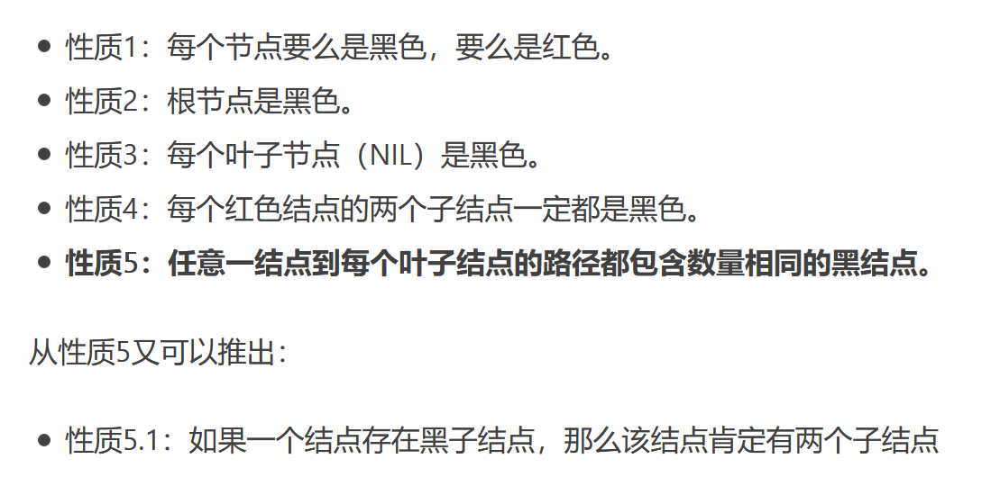

## 红黑树

- 红黑树是**自平衡**的==二叉查找树==
  
  - 二叉查找树BST：
    - 左子树上的所有节点均**小于**根节点的值
    - 右子树上的所有节点均**大于或等于**根节点的值
    - ==**已知任一(前、中、后)序列可构造出相应的树**==
  - 平衡树
    - 任意左右子树的高度相差不超过1

- 参考
  
  - [30张图带你彻底理解红黑树](https://www.jianshu.com/p/e136ec79235c)

- 重要性质
  
  